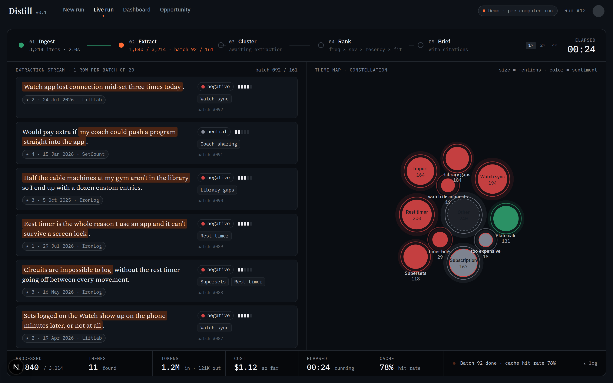
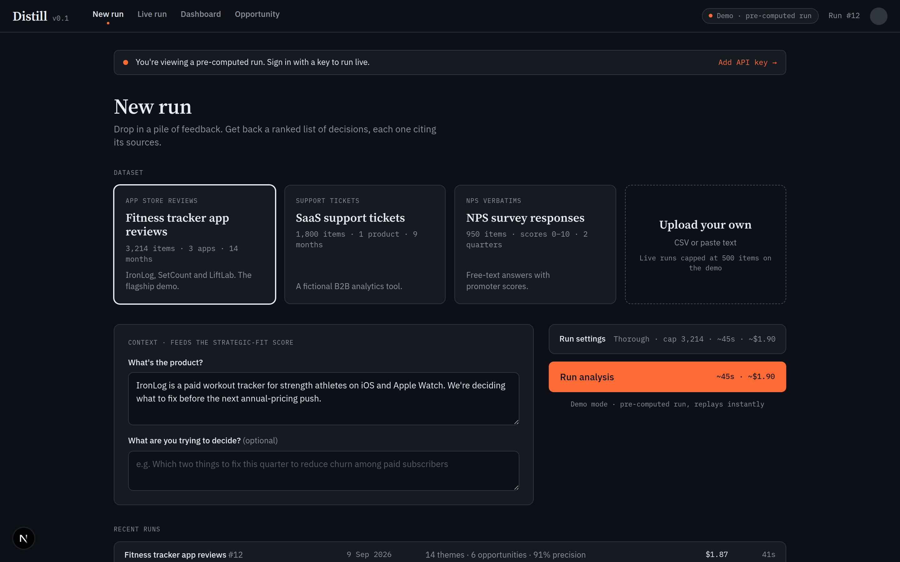
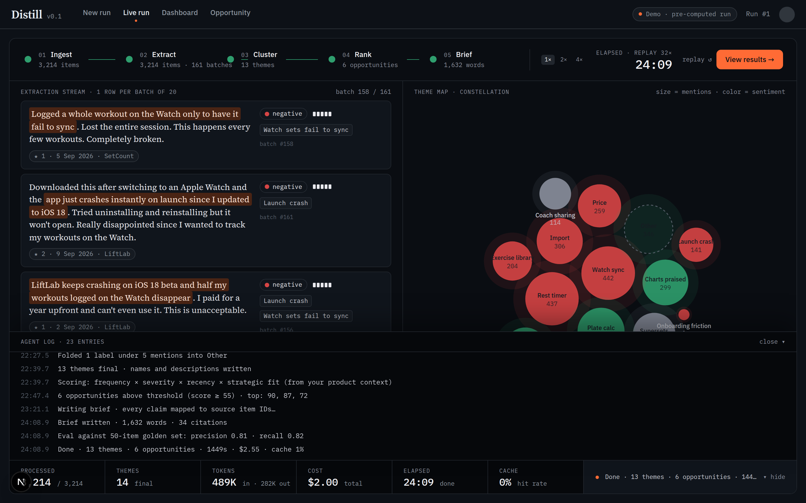
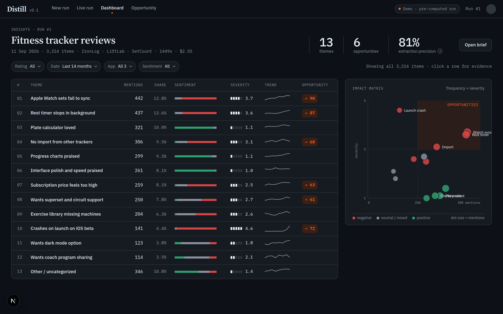
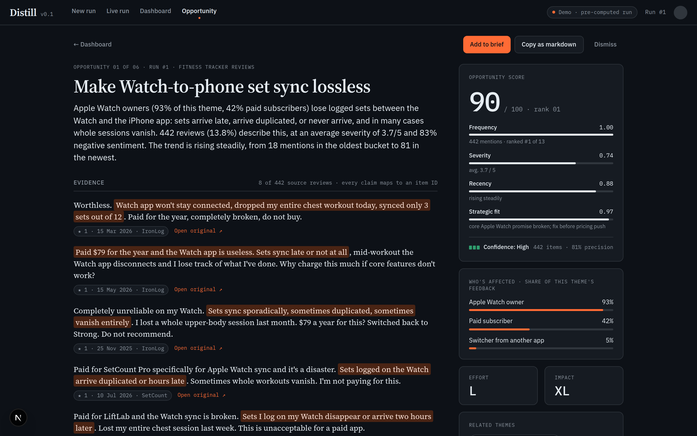

# Distill — Review Intelligence Agent

**Thousands of reviews in. Six decisions out. Every one of them cites its sources.**

Distill is an AI research agent that turns a pile of unstructured customer feedback
(app-store reviews, support tickets, survey verbatims) into a ranked list of product
opportunities, each backed by traceable evidence and written up as a brief a team could
act on tomorrow. You watch the agent work in real time, then explore the results.

**Live demo:** [distill-tau-five.vercel.app](https://distill-tau-five.vercel.app) · press
**Run analysis** and watch a real 3,214-review run replay in about 45 seconds.
**Demo video:** [promo/distill-demo.mp4](promo/distill-demo.mp4) (48s, recorded from the real app).

> Portfolio project #1 of 6. Built brief → Claude Design → code, same pipeline as
> [TITAN](https://github.com/LStar977/titan). Design source is in `design/handoff`.



## The case study

**Problem.** Reading 3,000 reviews takes a week. Skimming 50 gives a biased picture.
Asking a chatbot to "summarize" gives a paragraph nobody trusts, because it can't show
its work.

**What I built.** A five-stage agent pipeline (Ingest → Extract → Cluster → Rank →
Brief) on the Claude API, with a web app that streams the pipeline's events while it
runs and lets you drill from a ranked opportunity down to the exact review that
supports it.

**How AI is used.**

- **Structured extraction.** Every item is extracted in batches of 20 with structured
  outputs: sentiment, severity, theme labels, pain points, feature requests, verbatim
  quote spans, and segments. Quotes are verified in code to be real substrings of the
  source; anything that isn't is dropped.
- **Taxonomy first, then consolidation.** A 200-item sample drafts a taxonomy so the
  extractor labels consistently. Labels proposed outside it are kept as raw and merged
  in a consolidation pass with a stated similarity.
- **Scoring is arithmetic, not vibes.** Opportunity score = frequency × severity ×
  recency × strategic fit, where fit is judged against the product context you typed
  in. Every factor is shown with its value and the reason.
- **The brief cites item IDs.** Each claim maps to a source item, so the evidence
  appendix is generated from the data, not from the model's memory.
- **A built-in eval.** A 50-item golden set per dataset reports precision and recall on
  theme assignment. The number sits in the dashboard header.
- **Cost-aware.** A cheaper current-generation model for bulk extraction, a stronger
  one for taxonomy, consolidation and the brief. The taxonomy prompt is cached; the
  live counters show tokens, cost and cache hit rate as the run happens.

**Result.** On the flagship dataset (3,214 synthetic reviews across three fictional
fitness trackers): 13 themes, 6 opportunities, a 1,632-word brief with 34 citations,
81% precision / 82% recall on theme assignment against a 50-item golden set, $2.55,
24 minutes of wall time on a rate-limited API tier. The two reliability failures the
dataset was planted with (Watch sync, background rest timer) came out as opportunities
#1 and #2, and the pipeline surfaced one theme the plan never named, "Interface polish
and speed praised", out of the uncategorized bucket.

## Screens

| New run | Live run | Dashboard | Opportunity |
| --- | --- | --- | --- |
|  |  |  |  |

## Running it

```bash
pnpm install
pnpm dev            # http://localhost:3000, replays the bundled demo run
```

The public demo replays pre-computed runs from `data/runs`, so it costs nothing to
host. To run the pipeline for real:

```bash
cp .env.example .env         # add DISTILL_API_KEY
pnpm data:generate           # builds data/datasets/fitness.json (+ golden set), ~$1.25 on Haiku
pnpm pipeline --dataset fitness --limit 100 --depth fast --out data/runs/fitness-sample.json   # smoke test, ~$0.10
pnpm pipeline --dataset fitness --depth fast --out data/runs/fitness.json                      # full run, ~$2.55
```

Every script has a hard spend cap (`--max-cost`, default $3.00) and stops itself
before the call that would cross it. The dataset generator saves progress after each
batch, so a stopped run resumes without re-spending. `--depth fast` extracts with
Haiku 4.5 and keeps Opus 5 for the taxonomy, consolidation, opportunities and brief,
which is where the writing quality shows. The whole flagship dataset plus a real run
cost about $4.50 in total including the smoke tests, and the hosted demo then costs
nothing to serve.

### Deploying

Zero-config on Vercel: import the repo, accept the detected Next.js settings, deploy.
No environment variables are needed for the public demo. The pre-computed runs in
`data/runs` are traced into the serverless bundles (`next.config.ts`), and the replay
stream declares a 60-second function limit and resumes client-side if a stream is cut.
Setting `DISTILL_API_KEY` on the deployment would enable live runs, which cost money
per run, so leave it unset for a public portfolio deploy.

Other scripts:

```bash
pnpm test                    # vitest: pipeline pure functions, replay reducer, layout
pnpm typecheck && pnpm lint
pnpm tsx scripts/build-demo-fixture.ts   # regenerate the design-derived reference fixture
pnpm screenshots                         # 1440×900 captures from a running dev server
pnpm video:record                        # records promo/distill-demo.mp4 from a running prod server (pnpm start -p 3100)
```

## How it's put together

```
src/
├── app/                    Next.js App Router pages and the SSE replay route
│   ├── page.tsx            New run
│   ├── runs/[id]/live      Live run (streams /api/runs/[id]/stream)
│   ├── runs/[id]           Dashboard + evidence drawer (?theme=t01)
│   └── runs/[id]/opportunities/[oppId]
├── components/             Screens and the shared pieces (evidence quote, chips, bars)
│   └── live/               Stage rail, extraction stream, constellation map, counters, log
├── lib/
│   ├── types.ts            Domain types and the PipelineEvent timeline schema
│   ├── replay.ts           Pure reducer: events → live-run state
│   ├── constellation.ts    Deterministic layout for the theme map
│   └── runs.ts             Loads RunFiles from data/runs
└── pipeline/               The agent: ingest, taxonomy, extract, cluster, rank, brief, eval
data/
├── datasets/               Bundled datasets and golden sets
└── runs/                   Pre-computed runs (final Run + event timeline)
design/handoff/             Claude Design prototypes this was built from
```

A pre-computed run and a live run share one wire format: an ordered list of
`PipelineEvent`s with a `t` in seconds. The live screen doesn't know or care which it is
watching.

## Honest notes

- The flagship dataset is **synthetic**: reviews for three fictional apps generated to
  a planned theme distribution, so the demo can show a full run with clean labels. The
  golden set's labels are planted by construction and spot-checked. Upload your own
  data to run on real feedback.
- The bundled run (`data/runs/fitness.json`) is a real pipeline run over that dataset.
  The design-derived fixture that stood in for it before is kept at
  `design/fixture/fitness-demo.json` as a reference and a test fixture.
- **Cheap by choice.** Extraction runs on Haiku 4.5, which brought the full run to
  $2.55. Haiku's prompt-cache minimum is 4,096 tokens and the extraction prompt is well
  under that, so the live "cache hit rate" counter reads near zero on this run. Sonnet
  5 extraction (`--depth thorough`) does cache and scores a little higher, for roughly
  $1.30 more. I chose not to pad the prompt to make the number look better.
- Long real runs replay compressed: a 24-minute run plays in about 45 seconds by
  default, with the real elapsed time on the clock and the rate shown next to it.
- Filters on the dashboard are static in this round. The Brief and Trust screens are
  designed in round two.

## Stack

Next.js 16, TypeScript, Tailwind v4, the official Anthropic TypeScript SDK with
structured outputs and prompt caching, Vitest, Playwright for captures, Vercel for
hosting. Fonts: Source Serif 4, IBM Plex Sans, IBM Plex Mono (OFL, self-hosted).
